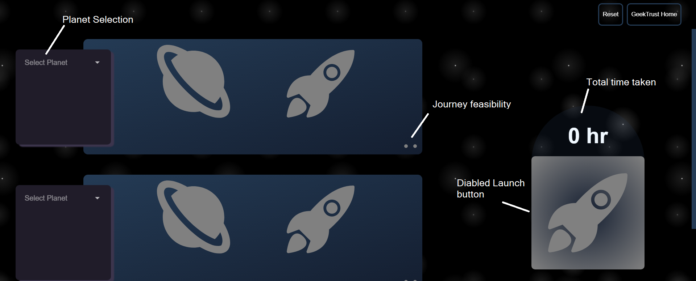
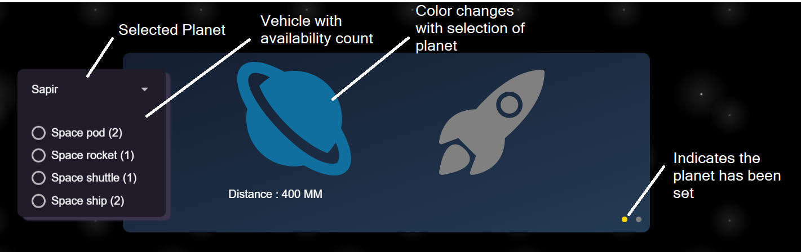
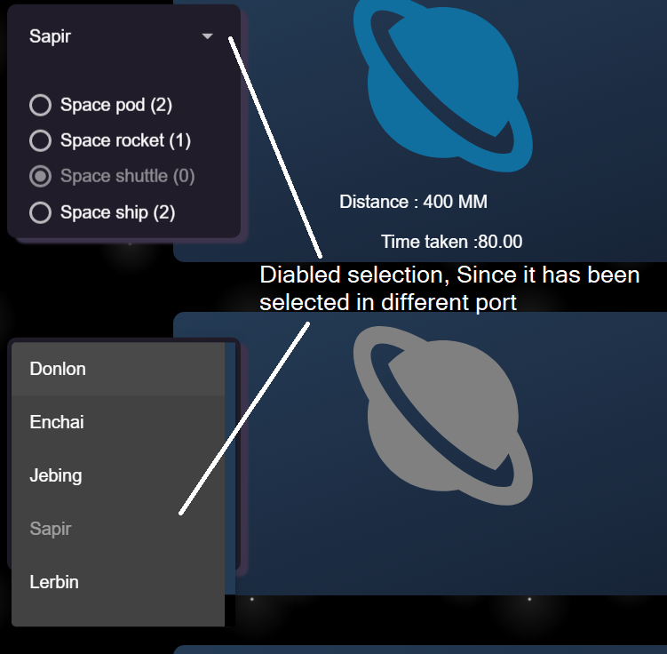
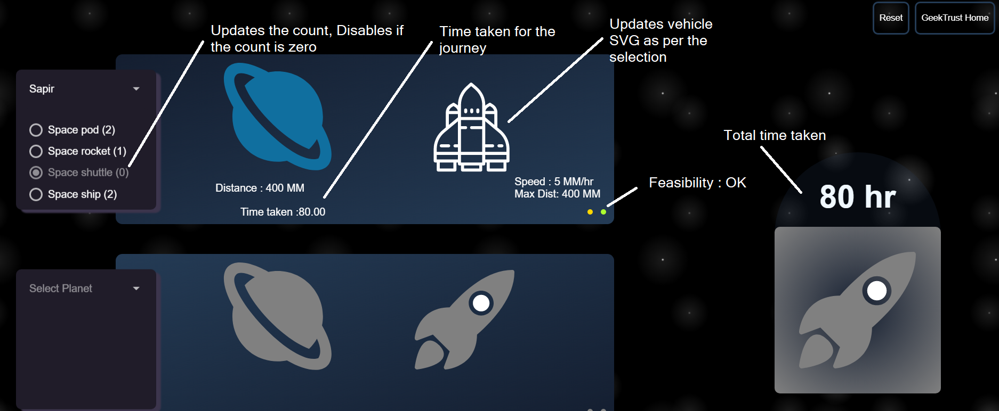
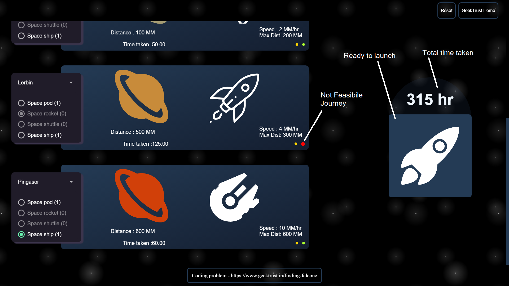
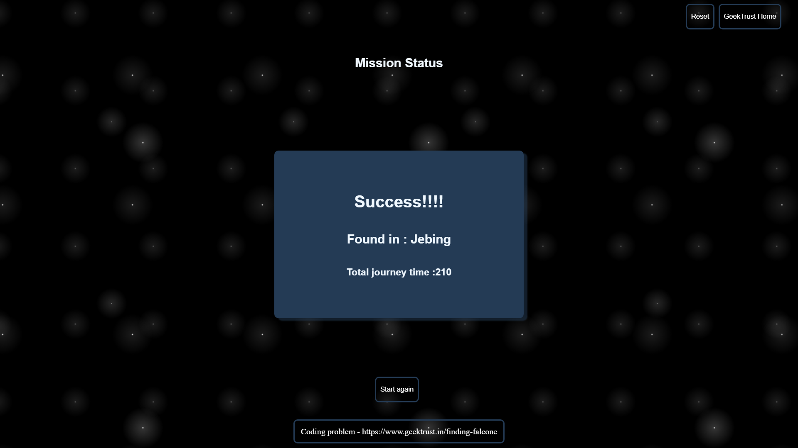

# **Finding Falcone**
#### Language: JavaScript
#### Frame Work: Angular 7
#### Style: SCSS
#### GIT Repo: ajayC07/Find-Falcone
### How to run: 
- Extract the File
- Run npm install to install the packages
- Run npm serve for a dev server. 
- Navigate to http://localhost:4200/

### About the implementation:

The implementation is done by using 3 Components in app component plus one common service and route module for handling navigation. Responsiveness is handled with flex box and media query

### COMPONENTS:

#### App Component:
- App component will be contains the header and footer with the router-outlet.

#### Base Component:
- Base component will provide the UI for selecting the planets and vehicle and allows the user to search for Falcone. Reactive form is preferred. Form Array has been used to reduce code redundancy.
- Selection of Planet: When a planet is selected in a port, the selected plant will be disabled for other ports. Indicating the planet has been already selected. Based on the selection of planet the color of the selected planet will be changed.
- Selection of Vehicle: When a planet is selected in a port. List of available vehicles will be shown as a radio selection. When the vehicle is selected, the count of availability decreases. When the option is changed for the selected vehicle the count will be adjusted as per the selection. Based on the selection of vehicle the display will be changed
- Launch: When all ports are set with planet and vehicle, the launch button will get enabled. On selection of valid journey with each port, the style of the launch button will be changed. Total time taken will be show above the launch button

- Misc: On selection of each planet and vehicle the details of the planet and vehicle will be shown. Time taken for that journey will be shown. Feasibility of the journey will be show. 
		‘Yellow’ -> Planet selected, 
		‘Green’ -> Journey is feasible, 
		   'Red’ -> Indicates the journey is not feasible and on hovering on red icon an alert will be shown
- Loader: On loading of API a loader will be shown as per the API. Loader is implemented with SVG with its animation property. In case the API fails the loader will be hidden
- Error handling: When the loader API fails the user will be shown with error message and given option to try again. If the token or launch API fails the user is informed with error message. 

**Note : Planet and vehicle SVG are taken from internet**

#### Mission status component

- The status of the mission is shown in different view by navigation with the result to mission status component. The status of the mission with time taken will be shown. On hovering on the container the details of mission will be shown. User will be provided with Start again option.

#### Loader component
 - Loader component will be shown whenever the API is triggered. It is implemented with SVG with its animation properties. Message differs w.r.t the API calls. In case the API fails the loaded will be removed from the view

### SERVICES:
- A single service file is used to handle API calls, Data transfer between the components.

### DATA TRANSFER 
- Data transfer between the sibling components is done with the help of Behavior Subject and within child – parent component decorators are used.

####  Please find screen shots below:

